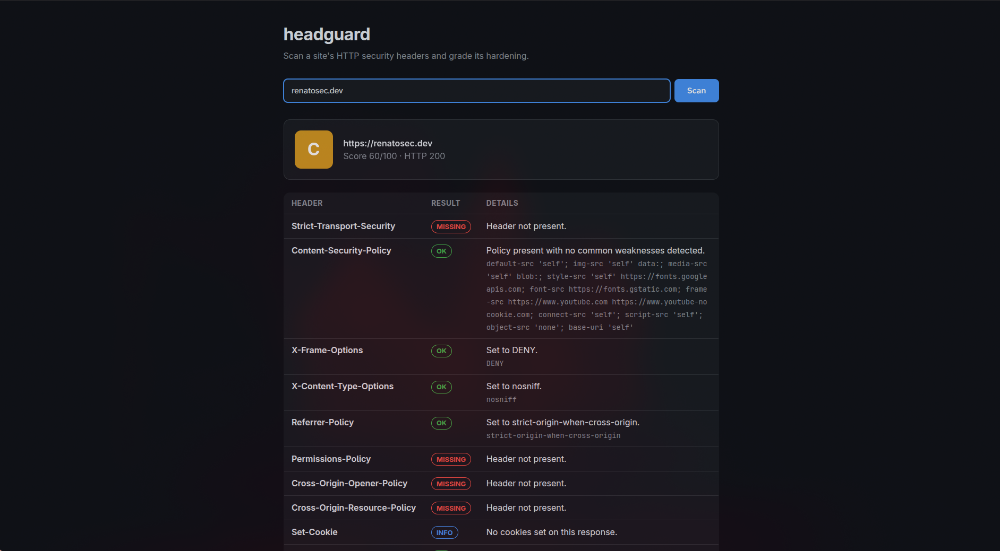
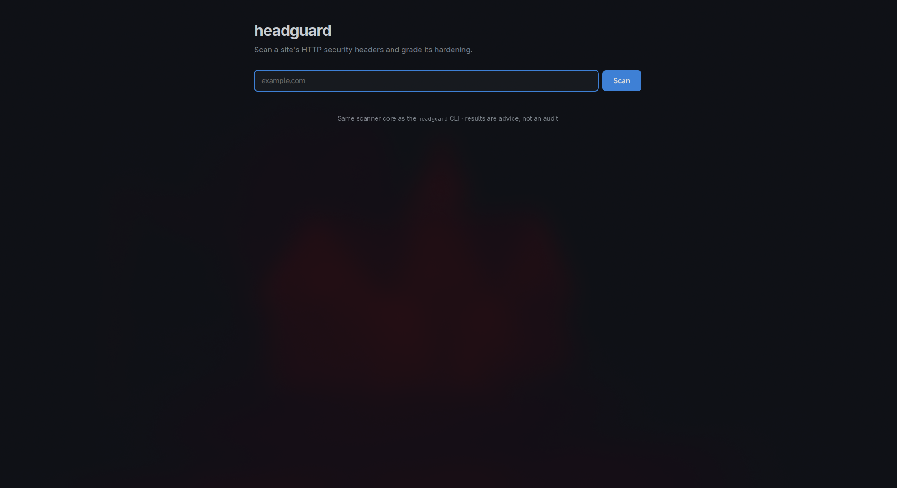

# headguard

[](https://github.com/Rena24Pt/headguard/actions/workflows/ci.yml)

A security tool that scans a website's HTTP **security headers** — HSTS, CSP,
X-Frame-Options, Referrer-Policy, Permissions-Policy, COOP/CORP and more — and grades
the site's hardening from **A+ to F**, with concrete recommendations for every gap.
Available as a CLI and as a web interface, sharing the same scanner core.



```
$ headguard example.com
```

## Why security headers?

Security headers are instructions a server sends the browser to switch on built-in
protections. Each check in headguard maps a header to the attack it mitigates:

| Header | Attack it mitigates | Weight |
|---|---|---|
| `Content-Security-Policy` | Cross-site scripting (XSS), data injection | 25 |
| `Strict-Transport-Security` | SSL stripping / HTTPS downgrade | 20 |
| `X-Frame-Options` / CSP `frame-ancestors` | Clickjacking (UI redressing) | 10 |
| `X-Content-Type-Options` | MIME sniffing → content-type confusion | 10 |
| `Referrer-Policy` | URL/token leakage to third parties | 10 |
| `Permissions-Policy` | Abuse of camera, mic, geolocation, ... | 10 |
| `Cross-Origin-Opener-Policy` | XS-Leaks, tabnabbing | 5 |
| `Cross-Origin-Resource-Policy` | Spectre-style cross-origin reads | 5 |
| `Set-Cookie` attributes (`Secure`, `HttpOnly`, `SameSite`) | Session hijacking, token theft via XSS, CSRF | 10* |
| No version disclosure (`Server`, `X-Powered-By`, ...) | CVE fingerprinting | 5 |

\* Cookie points only enter the total when the response actually sets cookies —
a site without cookies has nothing to protect and is not penalized.

It also flags **deprecated headers** (`X-XSS-Protection`, `Expect-CT`,
`Public-Key-Pins`) that should be removed, and warns when a CSP is weakened by
`unsafe-inline`, `unsafe-eval` or wildcard sources.

### Grading

The score (0–100) maps to a grade: **A+** ≥ 95, **A** ≥ 85, **B** ≥ 70, **C** ≥ 55,
**D** ≥ 40, **E** ≥ 25, otherwise **F**. Headers get partial credit when present but
misconfigured (e.g. an HSTS `max-age` under six months).

## Install

```bash
git clone https://github.com/Rena24Pt/headguard
cd headguard
python -m venv .venv && source .venv/bin/activate
pip install -e .
```

## Usage

```bash
headguard example.com                 # scan (scheme defaults to https://)
headguard https://example.com --json  # machine-readable output
headguard example.com --min-grade B   # exit 1 if grade is below B (CI gate)
headguard internal.host --insecure    # skip TLS verification
```

Exit codes: `0` success, `1` grade below `--min-grade`, `2` network/scan error.

### CI example (GitHub Actions)

```yaml
- name: Check security headers
  run: |
    pip install git+https://github.com/Rena24Pt/headguard
    headguard https://myapp.example --min-grade A
```

## Web interface

The same scanner core, behind a small FastAPI app:

```bash
pip install -e ".[web]"
headguard-web            # serves http://127.0.0.1:8000
```



Security decisions worth noting (this is a security tool, after all):

- **SSRF protection** — the API refuses to scan loopback, private, link-local
  and other non-public addresses, so a deployed instance cannot be used to
  probe its operator's internal network or a cloud metadata endpoint.
  (Known limitation: DNS rebinding between the guard's lookup and the actual
  request is not mitigated.)
- **It serves the headers it preaches** — scan it with its own CLI:
  `headguard http://127.0.0.1:8000` (it loses only the HSTS points, which
  belong at the TLS-terminating layer, not on a localhost dev server).
- **XSS-safe rendering** — the frontend renders scan results with
  `textContent`, never `innerHTML`: header values come from the scanned site
  and are treated as hostile input.
- **Binds to localhost by default** — exposing a URL-fetching service to a
  network is an explicit choice (`--host`), not a default.

## Development

```bash
pip install -e ".[dev]"
pytest
```

The scanner core is decoupled from both frontends (`headguard.scanner.scan()`
returns a plain `ScanResult`), which is what lets the CLI and the web app share
all scanning and grading logic.

## Roadmap

- [x] CLI with grade, colored report and JSON output
- [x] Web interface (FastAPI) on top of the same scanner core, with SSRF protection
- [x] `Set-Cookie` attribute analysis (`Secure`, `HttpOnly`, `SameSite`)
- [ ] Batch scanning of multiple URLs

## Ethics

Only scan sites you own or have permission to test. headguard sends a single
ordinary GET request — the same as visiting the page in a browser — but the
recommendations it produces are for hardening **your own** infrastructure.

## License

MIT
